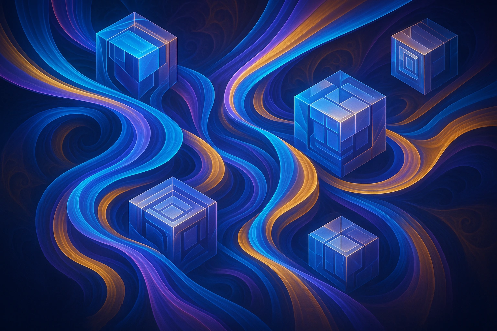

# Quantized-Containerized-Models

**quantized-containerized-models** is a project which aims to show how modern techniques such as quantization, containerization and CI/CD work together to produce fast, lightweight and production-ready model deployments.

Its core objective is to show that cutting edge AI systems can be built without sacrificing reproducibility, scalability or hardware efficiency.

## Replicate as the Deployment Platform of Choice

Replicate is a natural fit for this project because it is purpose-built for deploying models in isolated, reproducible containers. Its infrastructure automatically handles GPU provisioning, CUDA standardization and versioning, making it ideal for showcasing optimized, quantized models.

Replicate’s open-source library [Cog](https://cog.run/) ensures that container images remain consistent across development, testing and production, directly supporting the CI/CD and the testing needs of the project. Also, backed by [Cloudflare's](https://replicate.com/blog/replicate-cloudflare) infrastructure, Replicate offers a stable and performance-oriented platform well-suited for showcasing containerized AI deployments.

---

## 📜 License

This project is licensed under the [Apache License 2.0](LICENSE).

---
## 🌌 [SYSTEMIC_CONSISTENCY_CHECK]
**Status:** Synchronized with Sector 01
**Protocol:** AKH-093-SR / Aeterna-Redux
**Integrity:** Verified by ColdSilence989 (2025)
