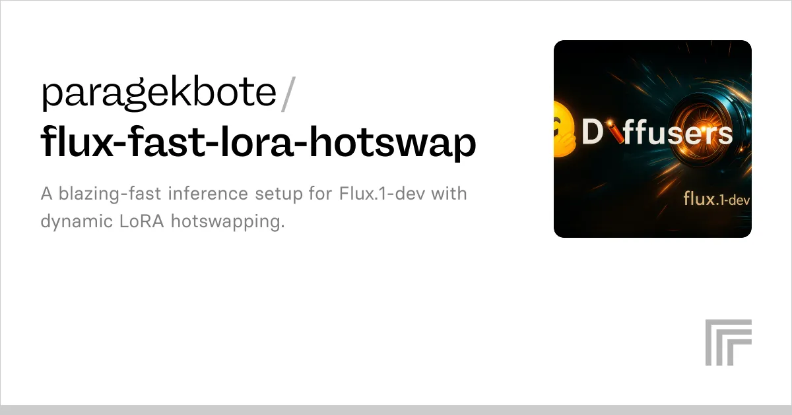

# System Architecture

This project provides a set of **performance-optimized, production-ready AI model deployments** built around a common architectural philosophy:

> **Reduce memory footprint and inference cost without sacrificing output quality**, while maintaining reproducibility and deployment portability.

The system combines **quantization, compilation, sparsity and containerization** to achieve this across multiple model classes (LLMs, multimodal models and diffusion models).

## High-Level Design Principles

Across all deployments, the architecture adheres to the following principles:

- **Post-training optimization** (no retraining required)
- **Inference-first design** (latency, throughput, VRAM efficiency)
- **Selective risk** (optimize compute-heavy layers, preserve fragile ones)
- **Portability** (Cog + Docker, no vendor lock-in)
- **Reproducibility** (deterministic builds, fixed schemas)

## SmolLM3-3B (Pruna + HQQ)


This deployment packages **SmolLM3-3B** using **Pruna**, **HQQ quantization** and **`torch.compile`** to enable fast, memory-efficient text generation.

### Core Components

**Pruna**
: Orchestrates model loading, quantization, compilation and output handling.

**HQQ Quantization**
: Reduces memory footprint and compute cost while preserving output quality through high-fidelity post-training quantization. Particularly effective for mid-sized decoder-only LLMs.

**`torch.compile`**
: Fuses operations and optimizes execution graphs, reducing Python overhead and improving kernel efficiency. Applied after quantization for maximal benefit.

### Features

- **Dynamic text generation** with `"think"` (reasoning-enabled) and `"no_think"` (concise output) modes
- **Configurable inference** including `max_new_tokens` (up to 16k), `seed` for reproducibility and `mode` selection
- **Automatic output persistence** — generated responses saved as `.txt` artifacts

This setup achieves **reduced VRAM usage**, **faster inference** and **stable output quality**, making it suitable for long-form generation workloads.

## Flux.1 [dev] (Text-to-Image with LoRA Hot-Swapping)



This deployment packages **black-forest-labs/FLUX.1-dev** for high-performance text-to-image generation with **dynamic LoRA switching**.

!!! info
    This work builds on techniques featured in the Hugging Face blog.

### Core Components

**PyTorch 2.x + `torch.compile`**
: Accelerates diffusion inference and improves kernel fusion and scheduling.

**BitsAndBytes Quantization**
: Reduces VRAM usage significantly, enabling larger models to run on smaller GPUs.

**PEFT LoRA**
: Lightweight adapters injected at runtime for instant style switching without reloading the base model.

### Dynamic LoRA Hot-Swapping

LoRAs are activated via **trigger words** in the prompt.

#### Enhanced Image Preferences

- **Trigger words:** `Cinematic`, `Photographic`, `Anime`, `Manga`, `Digital art`, `Pixel art`, `Fantasy art`, `Neonpunk`, `3D Model`, `Painting`, `Animation`, `Illustration`
- **LoRA:** `data-is-better-together/open-image-preferences-v1-flux-dev-lora`
- **Purpose:** Preference-aligned, high-quality image generation

#### Ghibsky Illustration

- **Trigger:** `GHIBSKY`
- **LoRA:** `aleksa-codes/flux-ghibsky-illustration`
- **Purpose:** Studio Ghibli–inspired skies and landscapes

### Performance Characteristics

- **Speed:** Up to 2× faster generation via `torch.compile`
- **Memory:** ~40% VRAM reduction through quantization
- **Quality:** Full FLUX.1-dev image quality preserved
- **Flexibility:** Instant style switching with no model reload

## Gemma 3 4B IT (Multimodal, Quantized & Sparse)


This deployment is a **performance-optimized adaptation of `google/gemma-3-4b-it`**, targeting efficient **image recogition + text generation**.

### INT8 Weight-Only Quantization

#### Why

- Reduces parameter size and memory bandwidth
- Enables real inference speedups on modern hardware (NVIDIA, Intel)

#### How

Applied post-training using:

```python
torchao.quantization.quantize_(model, Int8WeightOnlyConfig())
```

Weights are sanitized (contiguous, non-meta) prior to quantization.

#### Caveats

- Requires `torchao` at load and inference time
- Quantized checkpoints should always be smoke-tested

### Pruning Strategies

Pruning targets **`nn.Linear` layers only**, focusing on compute-dominant regions.

#### Motivation

MLP layers and QKV projections account for the majority of FLOPs per transformer block. Reducing parameters here yields significant gains with minimal quality loss.

#### Implemented Strategies

**Magnitude-Based Pruning**
: Retains top-K weights by absolute value through flatten → `torch.topk` → threshold → mask → `weight.mul_(mask)`. Simple and predictable.

**Gradual Magnitude Pruning**
: Sparsity increases progressively over multiple steps, helping avoid sudden performance degradation. Suitable for prune → fine-tune loops.

**Structured Sparsity (Safe Mode)**
: Removes entire output channels (rows) measured via L2 norm. Preserves tensor shapes and avoids downstream breakage.

### Filter Map (`gemma_filter_fn`)

A safety mechanism that defines where pruning is allowed.

**Whitelisted layers:**
: QKV projections, MLP up/down projections

**Blacklisted layers:**
: Embeddings, `lm_head`, LayerNorm, output projections

The filter map encodes pruning policy and prevents semantic breakage by targeting compute-heavy layers while avoiding structurally fragile components.

### Selective `torch.compile`

Rather than compiling the entire model, compilation is applied **selectively** to stable, compute-heavy submodules while avoiding embeddings, LM heads and fragile or version-sensitive components.

**Rationale:** Full-model compilation is costly and brittle. Selective compilation captures most performance gains with lower risk and improves portability across PyTorch versions and hardware.

## Phi-4 Reasoning Plus (Unsloth)


This deployment packages **`unsloth/phi-4-reasoning-plus`**, an optimized variant of Microsoft's Phi-4 reasoning model, focusing on **reasoning-centric inference** through **Unsloth kernel techniques**.

### Core Components

**Unsloth Optimization**
: Custom kernel fusion and memory-efficient execution paths reduce VRAM pressure and enable smooth inference on smaller GPUs while improving throughput without altering model semantics.

**Reasoning-Oriented Model Design**
: Tuned for structured, step-by-step logical reasoning with strong performance on explanation, problem solving and analytical tasks while maintaining conversational fluency.

### Features

- **Reasoning-first LLM** — produces explicit, logical explanations well-suited for educational, analytical and problem-solving use cases
- **Memory-efficient inference** — Unsloth optimizations allow deployment on constrained GPUs
- **Natural conversational behavior** — performs well with short, natural prompts without requiring chain-of-thought prompting tricks
- **Flexible decoding controls** — supports `temperature`, `top_p` and `max_new_tokens` for tuning between creativity, determinism and verbosity

### Usage Guidance

Prefer **short, natural prompts**:

```
Explain why the sky is blue in simple steps.
```

Control output length via `max_new_tokens`:

- Lower values for concise explanations
- Higher values for detailed reasoning traces

This deployment is ideal when **reasoning quality and interpretability** are higher priorities than raw generation speed.

## FLUX.1-dev LoRA Hotswap (Image-to-Image)


This deployment extends the FLUX architecture to **image-to-image generation**, using **LoRA hot-swapping** to apply stylistic transformations to an input image while preserving content structure.

### Core Components

**Base Model**
: `black-forest-labs/FLUX.1-dev`

**PyTorch 2.x + `torch.compile`**
: Accelerates diffusion inference and improves kernel fusion and execution efficiency.

**BitsAndBytes Quantization**
: Reduces VRAM usage significantly, enabling image-to-image workflows on smaller GPUs.

**PEFT LoRA Hot-Swapping**
: LoRA adapters dynamically injected at runtime with style changes applied via trigger words and no base-model reload required.

### Features

- **Optimized performance** via `torch.compile` for faster inference paths
- **Dynamic LoRA switching** to swap styles instantly using prompt-level triggers
- **Memory efficiency** through quantization reducing GPU memory footprint
- **Multi-style image transformations** with two LoRAs preloaded for immediate use

### Available Styles

#### Enhanced Image Preferences

- **Trigger words:** `Cinematic`, `Photographic`, `Anime`, `Manga`, `Digital art`, `Pixel art`, `Fantasy art`, `Neonpunk`, `3D Model`, `Painting`, `Animation`, `Illustration`
- **LoRA:** `data-is-better-together/open-image-preferences-v1-flux-dev-lora`
- **Description:** Applies refined stylistic preferences learned from curated human preference data to the input image.

#### Ghibsky Illustration

- **Trigger:** `GHIBSKY`
- **LoRA:** `aleksa-codes/flux-ghibsky-illustration`
- **Description:** Transforms the input image into Studio Ghibli–inspired skies and landscapes.

### Performance Characteristics

- **Speed:** Up to 2× faster processing with `torch.compile`
- **Memory:** ~40% VRAM reduction via quantization
- **Quality:** Preserves FLUX.1-dev fidelity while restyling inputs
- **Flexibility:** On-the-fly LoRA switching without model reloads

This architecture is particularly effective for **creative image transformation pipelines** where style experimentation and rapid iteration are required.

## Summary

This architecture demonstrates that **carefully applied post-training optimizations**—quantization, sparsity, selective compilation and LoRA modularity—can deliver:

- Substantial memory savings
- Faster inference
- Stable, high-quality outputs

All deployments share a common design philosophy: **optimize where it matters, preserve where it breaks**.
