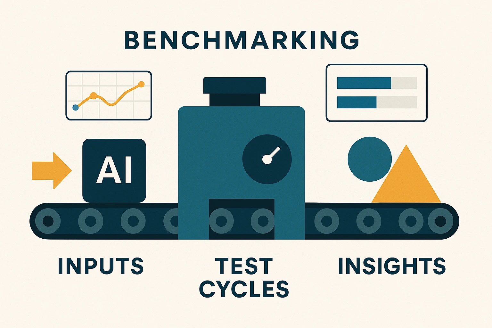
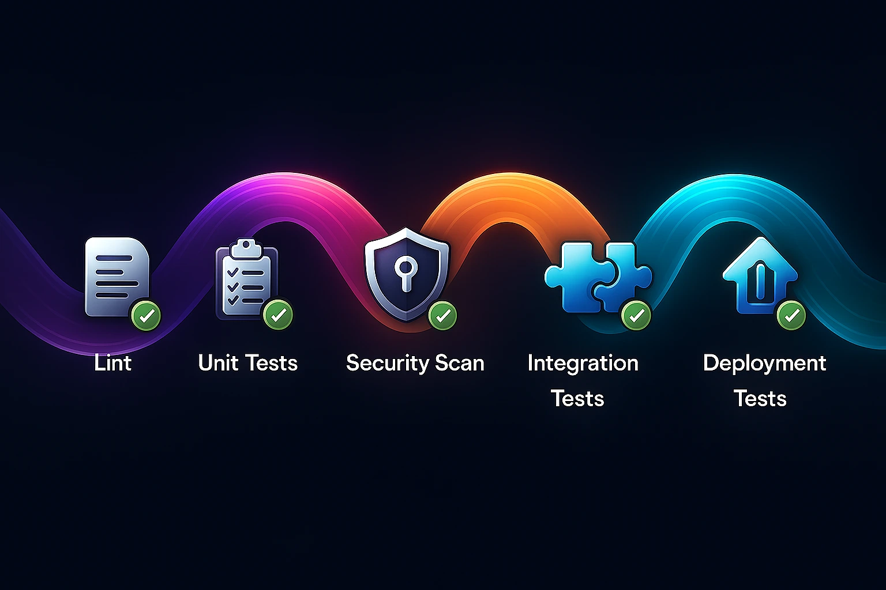

# 🚀 Deployments & API Reference

This document describes all available deployments, how they are validated, and how performance and correctness are ensured through **benchmarking and multi-tier testing**.

All deployments in this repository are **production-ready**, **quantization-aware**, and **containerized using Cog**, enabling seamless execution across local Docker, on-prem GPUs, and hosted platforms such as Replicate.

---

## Deployment Overview

The repository provides **five optimized deployments**, covering text generation, reasoning, multimodal inference, and diffusion-based image generation.

| Deployment                     | API Reference             | 
| ------------------------------ | ------------------------- | 
| Flux Fast LoRA Hotswap         | Text → Image              | 
| Flux Fast LoRA Hotswap Img2Img | Image → Image             | 
| SmolLM3 Pruna                  | Text (LLM)                | 
| Phi-4 Reasoning Plus (Unsloth) | Reasoning LLM             | 
| Gemma Torchao                  | Multimodal (Text + Image) | 

Each deployment exposes a **stable input schema**, supports deterministic inference and can be executed without vendor lock-in.

---

## Benchmarking Setup

Benchmarks are designed to measure:

* **Latency** 
* **VRAM usage**
* **Quality regression** (qualitative + task-based)
* **Impact of optimizations** (quantization, compile, sparsity)

---

## Three-Tier Testing Strategy

To ensure robustness across rapid upstream changes, the repository follows a **3-tier testing approach**.

---

### Tier 1: Unit Tests (Fast, Isolated)

**Purpose**

* Validate individual components
* Catch breaking API or logic changes early

**Examples**

* Quantization routines
* Pruning filters
* Input schema validation
* Utility functions

**Characteristics**

* CPU-first.
* Minimal runtime

---

### Tier 2: Integration Tests 

**Purpose**

* Validate that optimized models still load, run and produce outputs

**Examples**

* Load quantized checkpoints
* Run a single inference step
* Verify output shape / file generation
* Ensure schema compatibility

**Characteristics**

* 
* Small inputs and exponential re-try
* Focus on correctness, not performance

---

### Tier 3: Deployment Tests

**Purpose**

* Detect silent regressions before deployment
* Validate end-to-end behavior of the container.

**Characteristics**

* GPU-enabled (where available)
* Often run on deployment
* Backed by benchmark comparisons

---

## Observability & Debugging

Deployments are designed to be introspectable:

* Logs emitted at model load and inference
* Clear error surfaces for schema violations
* File-based outputs for inspection and auditing

---