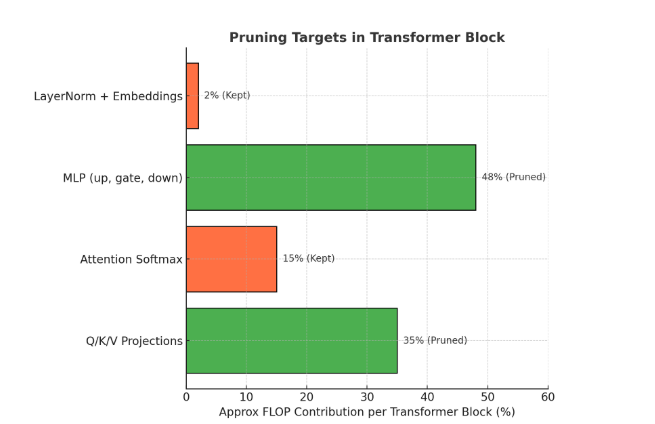

# gemma3-torchao-quant-sparse

**A performance-optimized adaptation of `google/gemma-3-4b-it`** — this setup applies INT8 weight-only quantization and multiple sparsity strategies to make Gemma faster and smaller while preserving strong multimodal (image+text) generation quality.

---

## Technical details

### Quantization (INT8, weight-only)
- **Why:** INT8 weight-only quantization reduces parameter size and memory bandwidth which often leads to real inference speedups on modern hardware that has optimized INT8 kernels (NVIDIA, Intel, etc.).
- **How:** Post-training quantize weights in-place using `torchao.quantization.quantize_(model, Int8WeightOnlyConfig())`. We sanitize weight tensors (contiguous, non-meta) prior to quantization.
- **Caveats:** Quantized checkpoints may require `torchao` support at load/inference time. Always run a smoke test after quantization.

### Pruning strategies implemented
All pruning routines target `nn.Linear` weights and use a custom `gemma_filter_fn` to avoid fragile layers.

To understand why pruning is implemented, observe the figure below:

As we can see the MLP and QKV projections consume the most amount of FLOPs per transformer block. So, we can use pruning to reduce total amount of model params while ensuring the model performance is not impacted at a greater level.

1. **Magnitude-based pruning**
   - Keep the largest-magnitude weights (Top-K by absolute value) and zero others.
   - Straightforward, predictable, and widely used.
   - Implementation: flatten -> `torch.topk` -> threshold -> mask -> `weight.mul_(mask)`.

2. **Gradual magnitude pruning**
   - Increase sparsity progressively over many steps (configurable, e.g., 1000 steps).
   - Helps avoid sudden performance drop by letting the model adapt (useful for iterative prune → fine-tune loops).
   - Implementation: at step `s` apply target sparsity `= target * (s/total_steps)`.

3. **Structured sparsity (safe / least-breaking)**
   - Prunes entire output channels (rows of weight matrices) rather than individual weights.
   - Channel importance measured by `L2` norm; least important channels are zeroed.
   - Preserves layer shapes (no dimension removal), which keeps downstream layers stable and avoids shape/broadcast errors.

### Filter map
- The filter map (`gemma_filter_fn`) is a function / mapping that:
  
- **Whitelists** layers safe to prune (e.g., `self_attn.q_proj`, `mlp.up_proj`, etc.).
- **Blacklists** fragile components (embeddings, `lm_head`, LayerNorm, output projection).
- **Why it’s vital:** It encodes the pruning policy — where to take risk and where not to. The filter map dramatically improves safety by limiting pruning to compute-dominant layers (Q/K/V, MLP) and avoiding layers that break model semantics.

### Selective `torch.compile`
- `torch.compile` is applied only to stable, compute-heavy submodules (e.g., embedding or LM head compilation is avoided unless safe).
- 
- **Why selective?** Compiling an entire large model consumes time and produces artifacts that are not portable across PyTorch versions / devices. Selective compilation reduces overhead while still getting kernel fusion and memory-planning benefits where it matters most.
